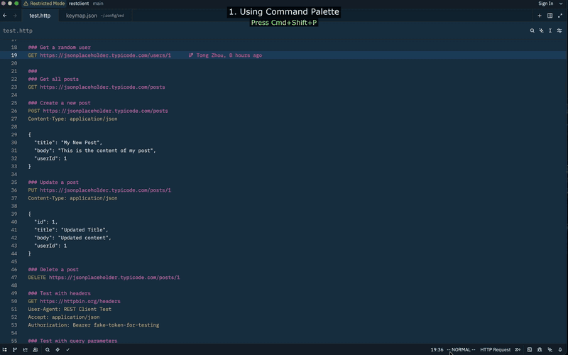

<div align="center">
  
</div>

<h1 align="center">REST Client Extension for Zed</h1>

<p align="center">
  <a href="https://github.com/zed-ext/restclient/actions/workflows/ci.yml"></a>
  <a href="https://github.com/zed-ext/restclient/releases/tag/v0.1.0"></a>
  <a href="https://github.com/zed-ext/restclient/blob/main/LICENSE"></a>
  
  
  <a href="https://github.com/zed-ext/restclient/stargazers"></a>
</p>

<p align="center">
  A REST client extension for <a href="https://zed.dev">Zed</a> that lets you write and execute HTTP requests directly from <code>.http</code> and <code>.rest</code> files.
</p>

## Demo



---

## Quick Start

### 1. Install the Extension

```bash
./install_to_zed.sh
```

### 2. Restart Zed

Completely quit Zed (`Cmd+Q` on macOS) and reopen it.

### 3. Try the Examples

Open any file from the `examples/` directory:

- `examples/basic.http` — GET, POST, PUT, PATCH, DELETE
- `examples/variables.http` — File-level variables, nested resolution
- `examples/response-capture.http` — Save values from responses
- `examples/edge-cases.http` — Error codes, slow requests, response formats
- `examples/environments.rest` — Environment variables (JetBrains-compatible)

Or create your own `.http` file:

```http
### Test request
GET https://httpbin.org/get
```

### 4. Execute the Request

**Option A: Click the ▶ Send Button**

Look above each HTTP request — you'll see a clickable **▶ Send** button.
Click it to execute the request and see the response in the terminal panel.

**Option B: Send in New Tab**

Click the **⊕ Send in New Tab** button to open the response in a dedicated terminal tab (labeled with the request URL).

**Option C: Generate cURL**

Click the **📋 Generate cURL** button to copy the request as a cURL command to your clipboard.

**Option D: Using Command Palette**

1. Click anywhere in the request
2. Press `Cmd+Shift+P` (macOS) or `Ctrl+Shift+P` (Linux)
3. Type "task spawn"
4. Select "▶ Send Request", "⊕ Send in New Tab", or "📋 Generate cURL"

---

## Features

- **▶ Send Request** — Execute HTTP requests with a single click, reusing the same terminal
- **⊕ Send in New Tab** — Execute in a new terminal tab, titled with the request URL
- **📋 Generate cURL** — Copy any request as a cURL command to clipboard
- **Syntax Highlighting** — Full highlighting for `.http` and `.rest` files
- **Autocompletion** — HTTP methods, headers, header values, and variable references
- **Document Symbols** — Navigate requests via the symbol outline
- **Variable Support** — `@variable = value` declarations with `{{variable}}` substitution
- **Response Variable Capture** — Save values from responses with `client.global.set()` (JetBrains-compatible)
- **Environment Variables** — JetBrains-compatible `http-client.env.json` + `http-client.private.env.json` with parent directory search
- **Multiple Requests** — Use `###` separators for multiple requests per file

---

## Writing HTTP Requests

### Basic Request

```http
### Simple GET request
GET https://httpbin.org/get
```

### POST with JSON Body

```http
### Create a user
POST https://api.example.com/users
Content-Type: application/json

{
  "name": "John Doe",
  "email": "john@example.com"
}
```

### Request with Headers

```http
### Authenticated request
GET https://api.example.com/data
Authorization: Bearer your-token-here
Accept: application/json
```

### Variables

```http
@baseUrl = https://api.example.com
@userId = 123

### Use variables with {{name}}
GET {{baseUrl}}/users/{{userId}}
```

Variables work in URLs, header values, and request bodies. Nested resolution is supported:

```http
@protocol = https
@host = api.example.com
@baseUrl = {{protocol}}://{{host}}

GET {{baseUrl}}/api/users
```

### Response Variable Capture

Save values from HTTP responses and reuse them in later requests (JetBrains HTTP Client syntax):

```http
### Login and capture the token
POST https://api.example.com/login
Content-Type: application/json

{
  "username": "demo",
  "password": "secret"
}

> 

###

### Use the captured token
GET https://api.example.com/users/{{user_id}}
Authorization: Bearer {{token}}
```

**Supported expressions:**

| Expression | Description |
|---|---|
| `response.body.field` | JSON field access (dot notation) |
| `response.body.data[0].id` | Array index access |
| `response.body.user.profile.name` | Nested field access |
| `response.headers.valueOf("X-Request-Id")` | Response header value |
| `response.status` | HTTP status code |
| `"string literal"` | Static string value |

Captured variables are persisted to `.http-client/.global-variables.json` and available across requests.

---

## File Format

The extension supports the [JetBrains HTTP Client file format](https://www.jetbrains.com/help/idea/http-client-in-product-code-editor.html):

```http
### Comment describing the request
METHOD URL
Header-Name: Header-Value

Request Body
```

Use `###` to separate multiple requests. Lines starting with `#` or `//` are comments.

> **Tip:** Use `### Section Title` for section dividers between requests. Standalone `# comment` lines
> placed after a blank line following a request may not be highlighted correctly, because the
> tree-sitter HTTP grammar can interpret them as request body content. Using `###` ensures
> consistent syntax highlighting throughout the file.

---

## Environment Variables

Environment variables follow the [JetBrains HTTP Client convention](https://www.jetbrains.com/help/idea/http-client-in-product-code-editor.html). Place environment files alongside your `.http`/`.rest` files:

```
your-project/
├── http-client.env.json           # Public environment variables (commit to git)
├── http-client.private.env.json   # Private overrides (gitignored — secrets go here)
├── .http-client/
│   └── .global-variables.json     # Persisted response capture variables
├── api.http
└── api.rest
```

**`http-client.env.json`** (public — safe to commit):

```json
{
  "activeEnv": "development",
  "development": {
    "base_url": "https://httpbin.org",
    "api_url": "https://httpbin.org",
    "timeout": "5000"
  },
  "staging": {
    "base_url": "https://staging.example.com",
    "api_url": "https://staging.example.com/api"
  },
  "production": {
    "base_url": "https://api.example.com",
    "api_url": "https://api.example.com/api"
  }
}
```

**`http-client.private.env.json`** (private — add to `.gitignore`):

```json
{
  "development": {
    "api_key": "dev-key-12345",
    "auth_token": "dev-token-abcdef"
  },
  "staging": {
    "api_key": "staging-key-67890",
    "auth_token": "staging-token-ghijkl"
  }
}
```

Private variables override public ones with the same name. The extension searches the directory containing your `.http` file first, then walks up parent directories.

The `"activeEnv"` key in `http-client.env.json` specifies which environment is active. Change it to switch environments:

```json
"activeEnv": "staging"
```

Then reference environment variables in your requests:

```http
### Uses base_url from the active environment
GET {{base_url}}/api/users
Authorization: Bearer {{auth_token}}
```

**Variable resolution order** (highest priority first):

1. File-level variables (`@variable = value`)
2. Global variables (captured from response handlers)
3. Active environment variables
4. System environment variables

See `examples/environments.rest` for a full working example.

---

## Development

### Building

```bash
# Build the WASM extension
cargo build --release --target wasm32-wasip1

# Build the LSP server and CLI
cd lsp && cargo build --release
```

### Installing

```bash
./install_to_zed.sh
```

### Project Structure

```
restclient/
├── src/
│   └── lib.rs              # WASM extension entry point
├── lsp/
│   ├── src/
│   │   ├── main.rs         # LSP server (completions, symbols, diagnostics)
│   │   ├── parser.rs       # HTTP file parser
│   │   ├── variables.rs    # Variable resolution
│   │   ├── response_handler.rs  # Response variable capture
│   │   └── bin/
│   │       └── http-client.rs  # CLI binary for executing requests
│   └── Cargo.toml
├── languages/http/
│   ├── config.toml         # Language configuration
│   ├── highlights.scm      # Syntax highlighting
│   ├── runnables.scm       # Tree-sitter runnable captures
│   └── tasks.json          # Task definitions (▶ Send / ⊕ New Tab / 📋 cURL)
├── examples/
│   ├── http-client.env.json       # Public environment config
│   ├── http-client.private.env.json # Private environment config
│   ├── .http-client/
│   │   └── .global-variables.json # Response capture storage
│   ├── basic.http          # GET, POST, PUT, PATCH, DELETE examples
│   ├── variables.http      # Variable substitution examples
│   ├── response-capture.http  # Response variable capture examples
│   ├── edge-cases.http     # Error codes, slow requests, formats
│   └── environments.rest   # Environment variables example
├── grammars/               # Tree-sitter grammar
├── extension.toml          # Extension manifest
└── Cargo.toml              # WASM crate config
```

---

## Troubleshooting

### ▶ Send buttons don't appear

1. Restart Zed completely (`Cmd+Q` and reopen)
2. Check LSP is running: View → Server Logs → HTTP LSP
3. Reinstall: `./install_to_zed.sh`

### Syntax highlighting not working

1. Check file extension is `.http` or `.rest`
2. Restart Zed completely
3. Reinstall: `./install_to_zed.sh`

---

## License

MIT

## Contributing

Contributions welcome! Please open an issue or PR. See [docs/CONTRIBUTING.md](docs/CONTRIBUTING.md) for details.
